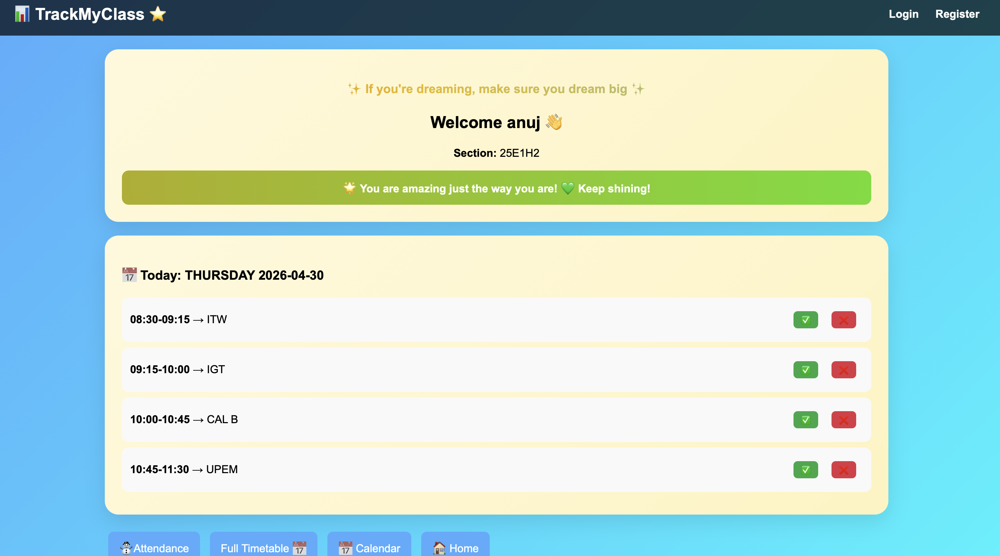
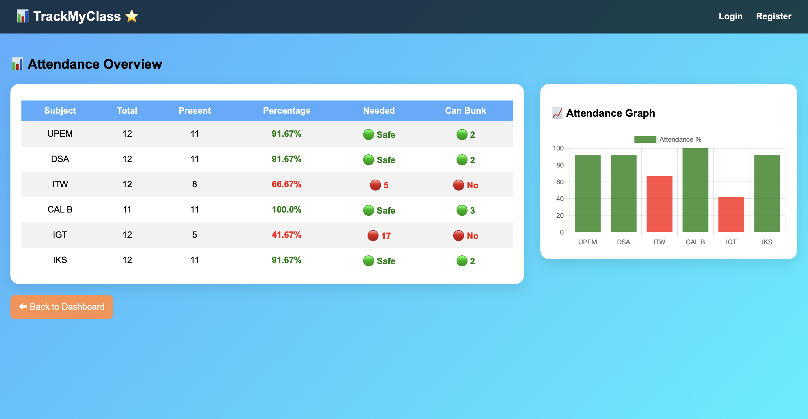
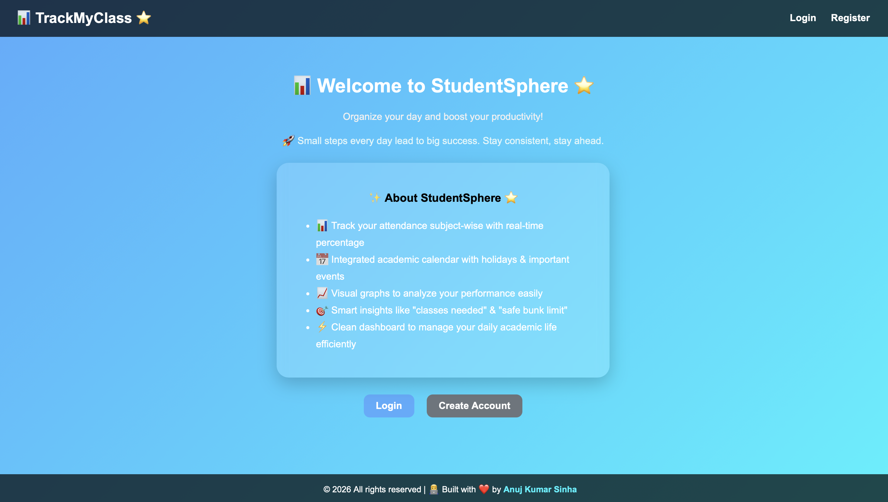
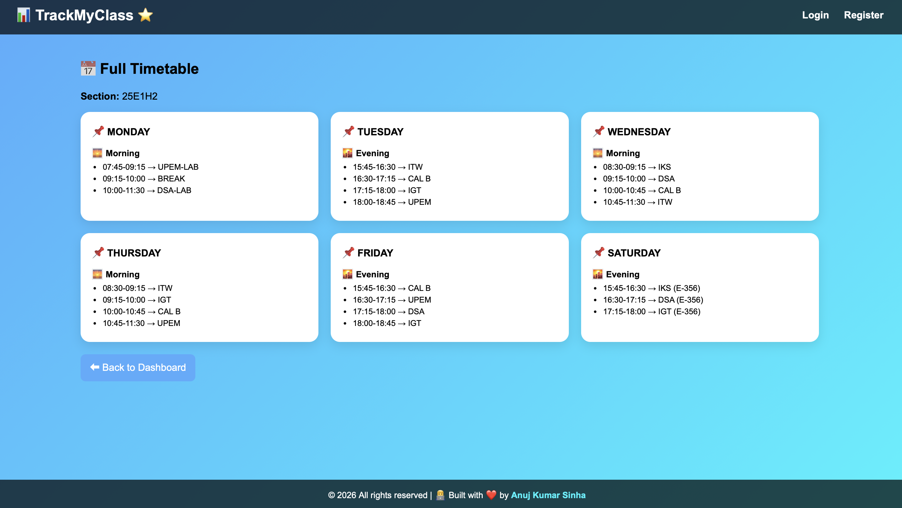

# 📊 TrackMyClass ⭐

A modern **Student Attendance & Academic Tracker Web App** built using Flask.
It helps students manage attendance, analyze performance, and stay organized with a clean and responsive UI.

---

## 🚀 Features

* 📊 **Attendance Management**
  Track subject-wise attendance with real-time percentage calculation

* 📈 **Analytics Dashboard**
  Visualize attendance using interactive graphs (Chart.js)

* 📅 **Smart Calendar**
  Manage holidays, events, and academic schedules

* 🔐 **Authentication System**
  Secure Login & Registration

* 📱 **Responsive Design**
  Works smoothly on desktop and mobile devices

---

## 🛠 Tech Stack

* **Frontend:** HTML, CSS, JavaScript
* **Backend:** Flask (Python)
* **Database:** SQLite
* **Libraries Used:**

  * Chart.js
  * FullCalendar

---

## 📂 Project Structure

```
TrackMyClass/
│
├── app/
│   ├── __init__.py
│   │
│   ├── routes/
│   │   ├── __init__.py
│   │   ├── auth.py
│   │   ├── feature.py
│   │
│   ├── models/
│   │   ├── __init__.py
│   │   ├── models.py
│   │
│   ├── templates/
│      ├── base.html
│      ├── dashboard.html
│      ├── attendance.html
│      ├── calendar.html
│      ├── home.html
│      ├── login.html
│      ├── register.html
│      ├── setup.html
│      ├── timetable.html
│   
│
├── instance/
├── run.py
├── seed.py
├── requirements.txt
├── README.md
```

---

## ⚙️ Installation & Setup

### 1️⃣ Clone Repository

```bash
git https://github.com/anujsinha1429/STUDENTSPHERE-.git
cd TrackMyClass
```

### 2️⃣ Create Virtual Environment

```bash
python -m studentenv venv
```

### 3️⃣ Activate Environment

```bash
# Windows
venv\Scripts\activate

# Mac/Linux
source studentenv/bin/activate
```

### 4️⃣ Install Dependencies

```bash
pip install -r requirements.txt
```

### 5️⃣ Run Application

```bash
python run.py
```

---

## 🌐 Usage

1. Register a new account
2. Login to dashboard
3. Add and manage attendance
4. View analytics & graphs
5. Track events using calendar

---

## 📸 Screenshots

### 🏠 Dashboard  


### 📊 Attendance  


### 🏡 Home  


### 📅 Timetable  


---

## 💡 Future Enhancements

* 🔔 Notification system
* ☁️ Cloud database integration
* 📱 Mobile app version
* 📊 Advanced analytics

---

## 🤝 Contributing

Contributions are welcome!
Fork the repo and submit a pull request 🚀

---

## 👨‍💻 Author

**Anuj Kumar Sinha**
🔗 https://www.linkedin.com/in/anujsinha1429/

---

## ⭐ Support

If you like this project, give it a ⭐ on GitHub!
